# Книжный магазин на Laravel

## Функционал

### Каталог книг
<p align="center">

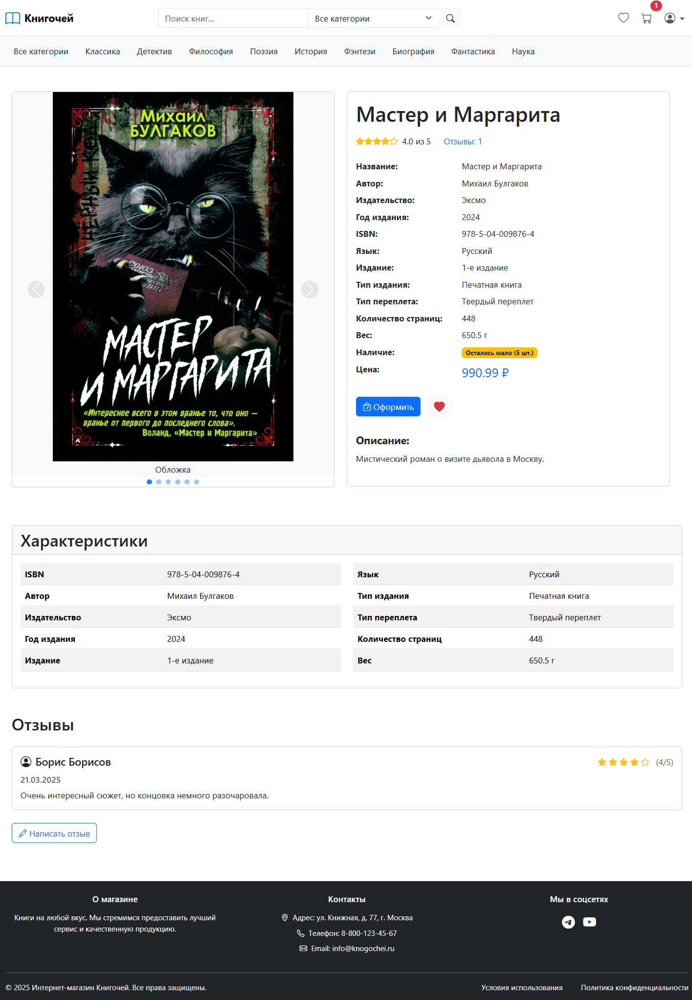
</p>

### Поиск и фильтры в каталоге
<p align="center">
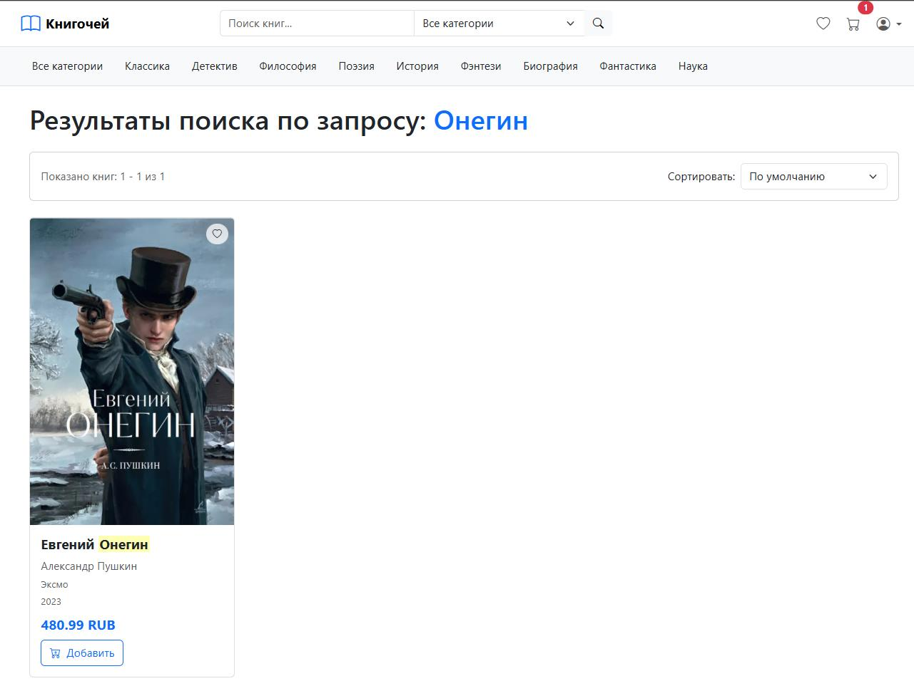

</p>

### Функционал корзины

<p align="center">
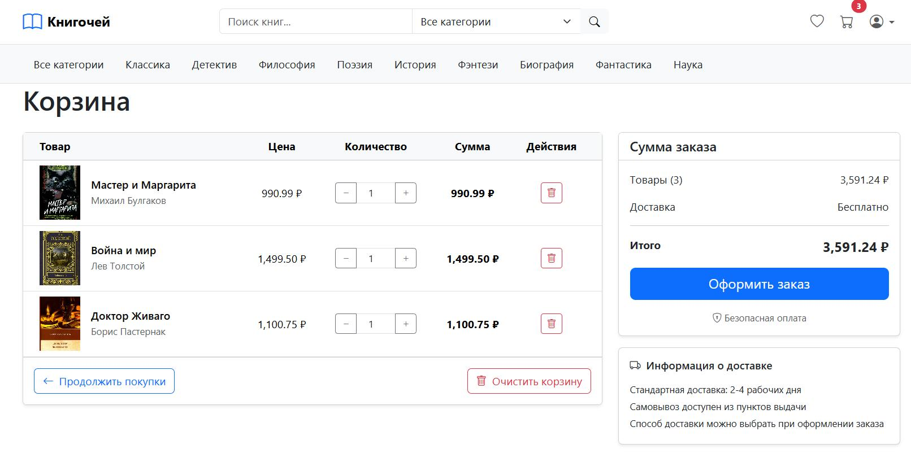
</p>

### Оформление заказа
<p align="center">
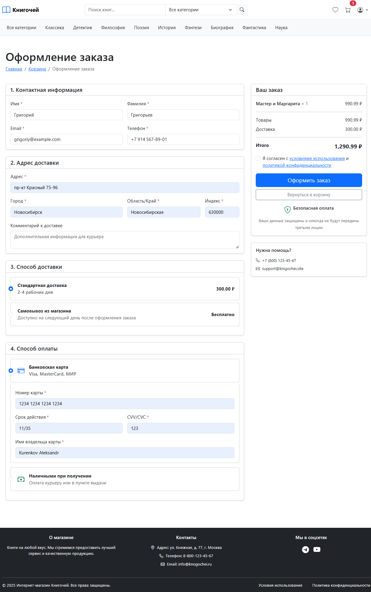
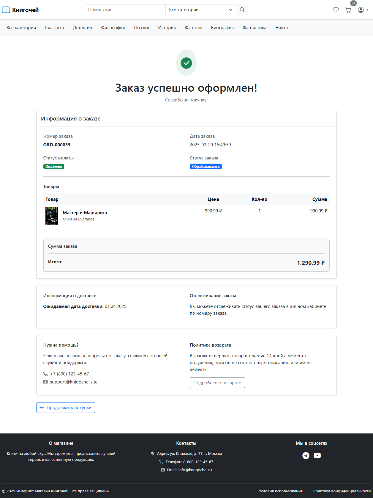
</p>

### Отмена заказа и возврат товара

<p align="center">
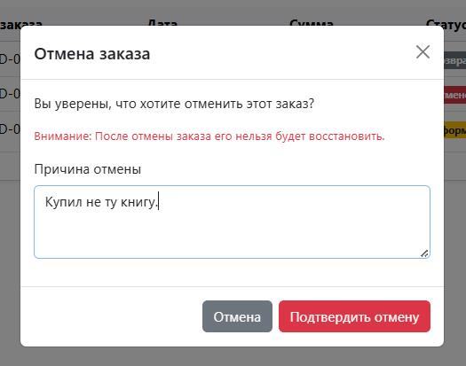
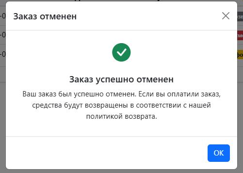
</p>
<p align="center">
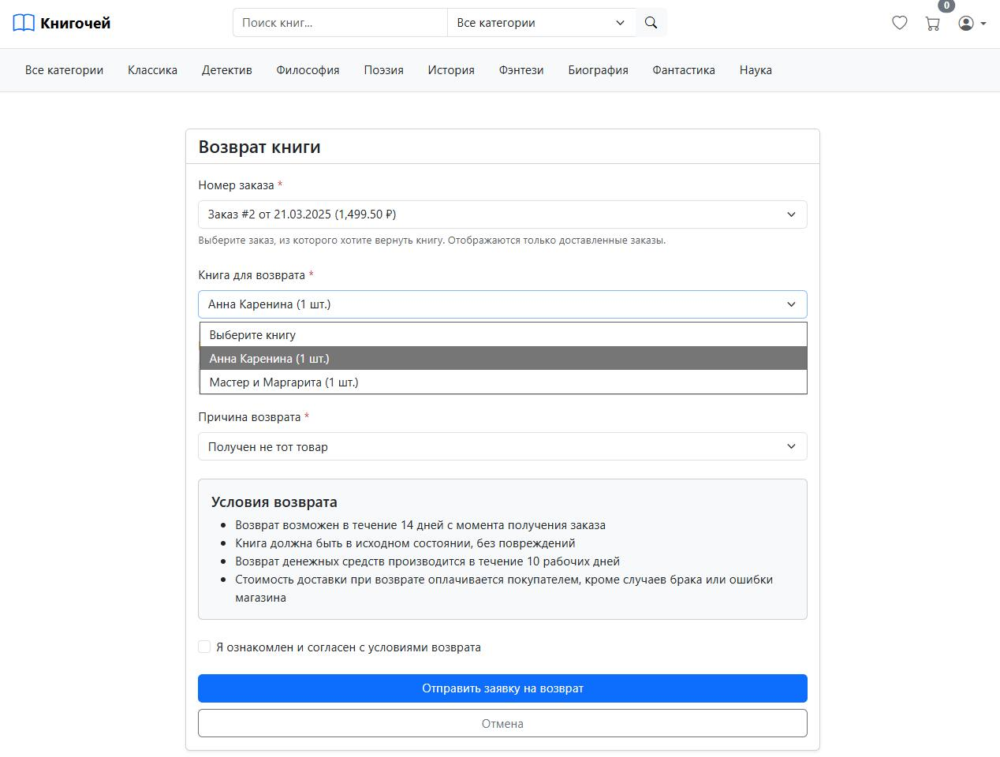
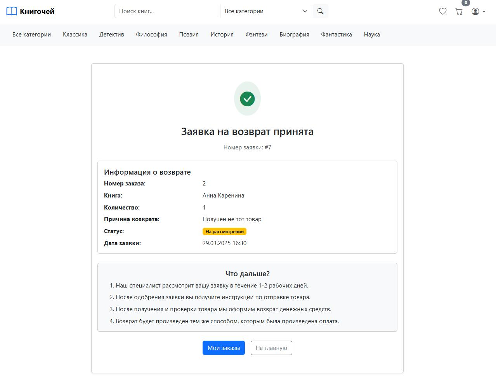
</p>

### Личный кабинет пользователя

<p align="center">
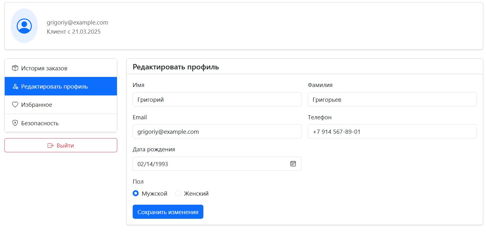
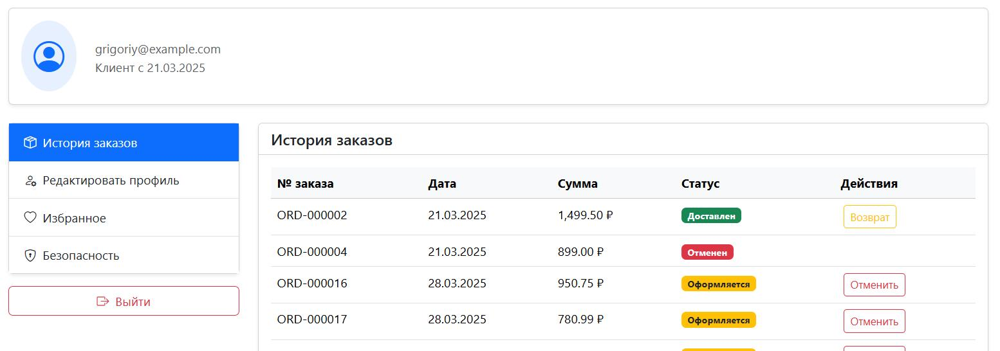
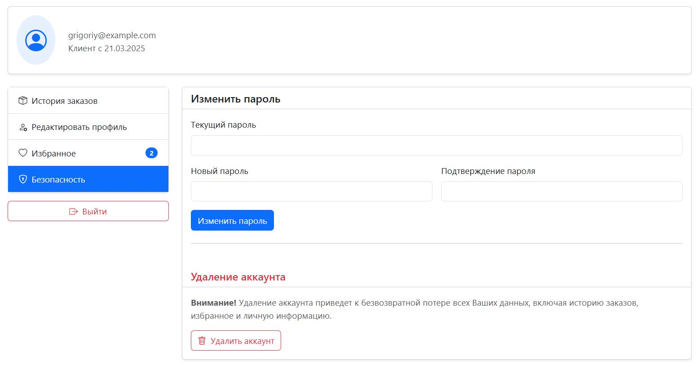
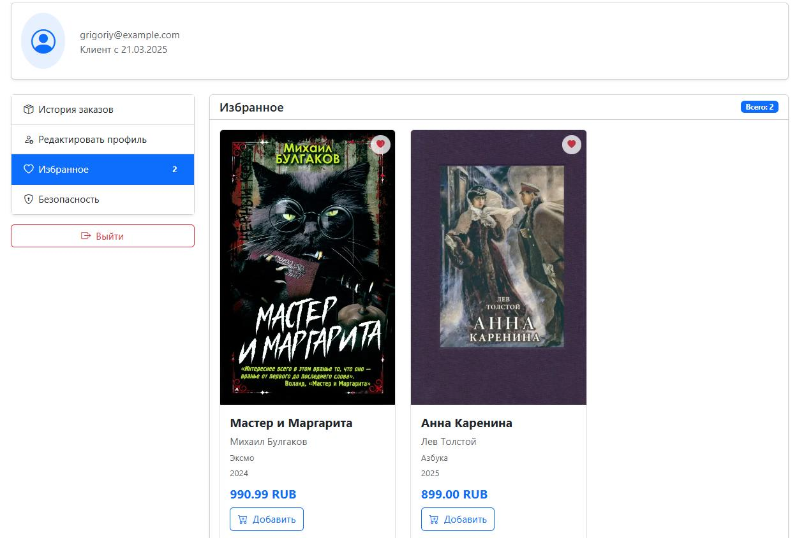
</p>

## Требования

* PHP 8.2+
* Laravel 11
* Postgres 15.7

## Установка

1. Клонировать репозиторий проекта
    ```bash
    $ https://github.com/AlexanderKurenkov/bookstore-laravel.git
    $ cd bookstore-laravel
    ```

2. Установить зависимости с помощью Composer
    ```bash
    $ composer install
    ```

3. Создать файл .env на основе .env.example и настроить подключение к базе данных
    ```bash
    $ cp .env.example .env

    # Отредактировать файл .env, указав нужные настройки
    $ nano .env
    ```

4. Создать базу данных, используя скрипты в папке `database/sql`
    ```bash
    # Перейти в каталог database/sql
    $ cd database/sql

    # Создание схемы базы данных
    $ psql -U <user> -d postgres -c "DROP DATABASE IF EXISTS <database>;"
    $ psql -U <user> -d postgres -c "CREATE DATABASE <database> WITH ENCODING 'UTF8';"
    $ psql -U <user> -d <database> --encoding=UTF8 -f schema.sql

    # Наполнение базы данных
    $ psql -U <user> -d <database> -f seeder.sql
    ```

5. Выполнить миграции (создание таблиц, используемых Laravel) и запустить приложение
    ```bash
    $ php artisan migrate
    $ php artisan serve --host=localhost --port=8080
    ```

6. Открыть веб-браузер и перейти на страницу приложения: http://127.0.0.1:8000
